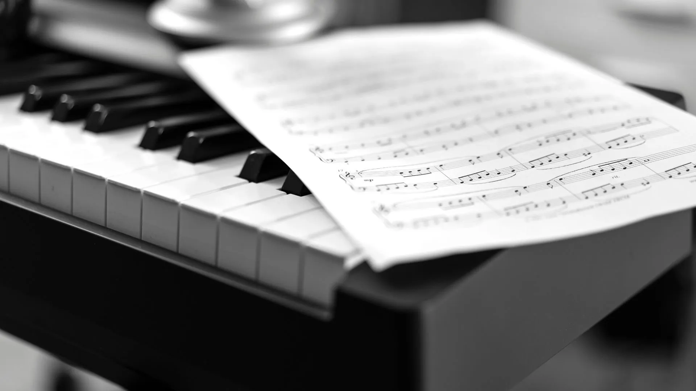

Logarithms were introduced to make products and divisions easier, but they also show up in many unexpected places: images, sound, and even music.

Take the piano keyboard. When you play, it does not really matter which key you start from: the structure still works. This is thanks to **equal temperament**, the system used to divide an octave into 12 equal steps.

Let’s start from a note with frequency **F**. One octave above it has frequency **2F**. If each step multiplies the previous frequency by the same factor **m**, then after 12 steps we must arrive at **2F**:

$$
F \cdot m^{12} = 2F
$$

Each semitone is obtained by multiplying the previous frequency by $2^{1/12}$.

For example, a very pleasant musical ratio is **3/2**. To find how many piano steps correspond to this ratio, we solve:

$$
\frac{3}{2} = 2^{k/12} \longrightarrow k = 12 \cdot \log_2(1.5) \approx 7
$$

That means a perfect fifth is about **7 semitones** above the starting note.

**Behind a nice chord, there is also a little logarithm doing its job.**

